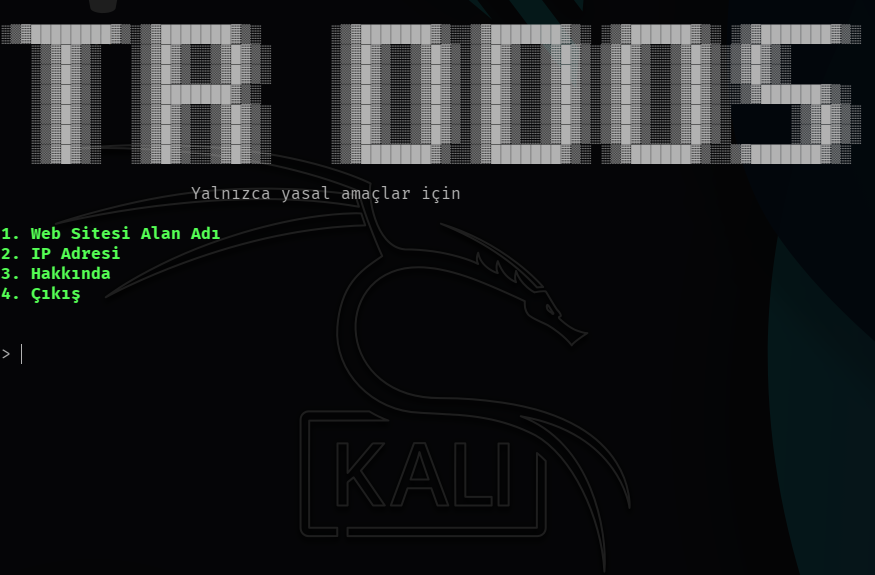
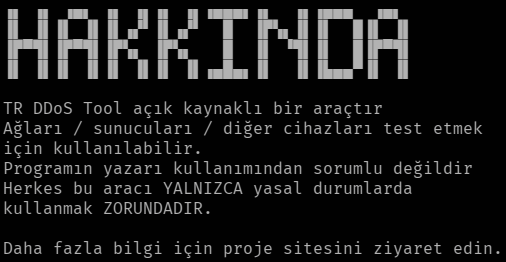

---

# 🇹🇷️ TR DDoS Tool

<p align="left" display="inline-block">
 </p>



## TrDDoS Tool Nedir?

```diff
! Bu, GitHub üzerindeki en iyi DDoS saldırı aracıdır.
```

*TrDDoS Tool*, DDoS saldırıları için geliştirilmiş bir araçtır.
Bununla ağları/sunucuları/veya diğer cihazları test edebilirsiniz.

## Nasıl Çalışır?

Hedefe sürekli paketler gönderir.
Bu saldırı türü *DDoS saldırısı* olarak bilinir.

## DDoS Saldırısı Nedir?

*Bağıtık Hizmet Engelleme* saldırısında (*DDoS saldırısı*), kurbana gelen trafik aşırı şekilde artırılır.
Bu durum, başka bir cihaza bağlanmayı fiilen imkânsız hale getirir.

## Desteklenen Cihazlar:

Bu program *Linux*, *Windows* ve *MacOS* gibi tüm işletim sistemlerini destekler.
Kod *python3* ile yazılmıştır, bu yüzden endişelenmeyin — hatasız şekilde çalışır.

## Kurulum (*Windows/Linux/MacOS/Termux*):

```
apt-get update -y
apt-get install git
git clone https://github.com/Red-company/RDDoS_Tool.git
cd RDDoS_Tool
bash setup.sh
python3 RDDoS_Tool.py
```

## Tek Satırda Kurulum:

```
apt-get update -y && apt-get install git && git clone https://github.com/SideX-Web/TDDoS/ && cd TDDoS && pip install tqdm && pip install pyfiglet && python3 tddos.py
```

## Hatalar mı Var? Çözüm Burada:

Eğer kütüphanelerle ilgiliyse, sadece şu komutları yazın:

```
pip install tqdm
pip install pyfiglet
```

## Ekran Görüntüleri? İşte Burada:



## Yasal Uyarı

Bu araç yalnızca **eğitim amaçlı** kullanılmalıdır.
Yaptığınız işlemlerden doğacak sorumluluk size aittir.

##

---
